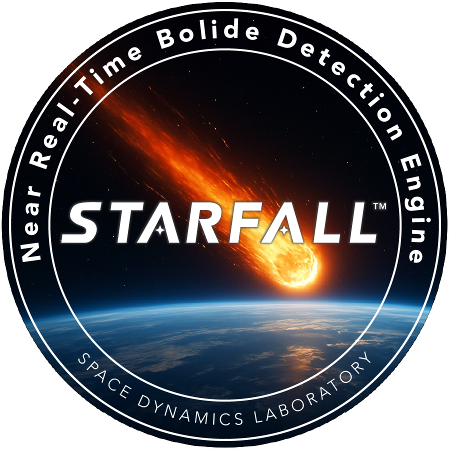
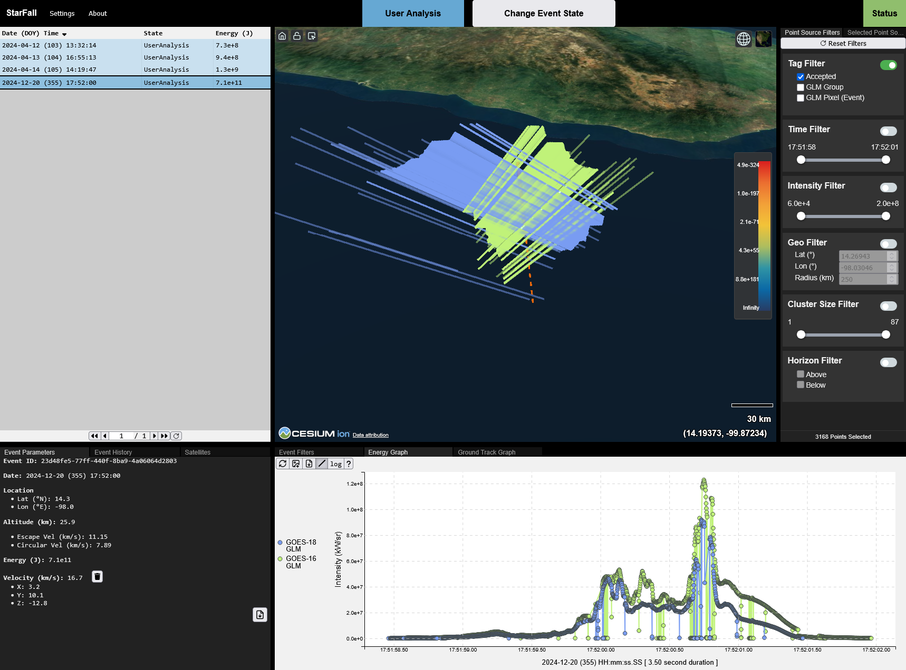

<!-- 
# ------------------------------------------------------------------------
# Licensed to the Apache Software Foundation (ASF) under one
# or more contributor license agreements.  See the NOTICE file
# distributed with this work for additional information
# regarding copyright ownership.  The ASF licenses this file
# to you under the Apache License, Version 2.0 (the
# "License"); you may not use this file except in compliance
# with the License.  You may obtain a copy of the License at
#
#     http://www.apache.org/licenses/LICENSE-2.0
#
# Unless required by applicable law or agreed to in writing,
# software distributed under the License is distributed on an
# "AS IS" BASIS, WITHOUT WARRANTIES OR CONDITIONS OF ANY
# KIND, either express or implied.  See the License for the
# specific language governing permissions and limitations
# under the License.
# ------------------------------------------------------------------------
-->



# StarFall&trade; – Near Real-Time Bolide Detection Engine

## Overview

The **StarFall** software enables users to detect bolides, or fireballs, in the sky in near real-time. Bolides are a type of bright meteor which explode as they enter Earth's atmosphere.



## Introduction

**StarFall** is a near real-time bolide detection and alert system that was built by the [Space Dynamics Laboratory](https://sdl.usu.edu/) while under the support of [NASA's Planetary Defense Coordination Office](https://science.nasa.gov/planetary-defense/). StarFall ingests Geostationary Lightning Mapper (GLM) L2 netCDF data from the National Oceanic and Atmospheric Administration’s (NOAA) Geostationary Operational Environmental Satellites (GOES). Although the GLM sensors were originally designed to detect lightning, they can also detect bolide signatures (see [Jenniskens et al. 2018](#references), and [Rumpf et al. 2019](#references)).

While many bolide resources exist, StarFall provides users with several advantageous features. When running in continuous mode, StarFall's GLM Trigger Generator (GLM TG) pulls GLM data continuously from NOAA's gcloud to form near real-time alerts of bolide events. Although some false positives occur on a daily basis, a key component of the GLM TG is the AI/ML ROCKET model ([McKinney et al. 2024, 2025](#references), [Dempster et al. 2020](#references)), which greatly reduces the number of false-positives to a managable amount for users. Additionally, the GLM TG also computes trigger parameter estimates including the time of the event (in UTC), the location of peak intensity, and the total radiated energy using Lockheed Martin continuum calibration tables for bolide events. If sufficient data is captured for stereo events, the GLM TG can also provide rough velocity estimates (speed and directional components). The web-based user interface also provides users with a way to interact and visualize the data used to form the bolide trigger and parameter estimates.

However, it should be noted that the NOAA directed GLM sensor, GOES on-board processing, and on-ground data pipelines were designed to detect lightning. Several assumptions were made during the design and development of the GLM sensor which may not be appropriate for bolide signatures. Consequently, quantitative studies of bolides using StarFall data may need to apply corrections to the parameter estimates. Known issues with bolide parameter estimates using GLM sensors have been reported on [NASA's NEO-Bolide website](https://neo-bolide.ndc.nasa.gov/#/info/about). Relatedly, StarFall typically underestimates total energy releases as compared to USG detected events listed on [JPL's CNEOS website](https://cneos.jpl.nasa.gov/fireballs/). StarFall velocity estimates can be poor due to GLM's relatively large pixel size and depending on event entry characteristics. Also, if an event is witnessed by only one GLM sensor, a stereo altitude estimate cannot be formed, and the location of the event is made at the peak intensity for a default altitude (32 km).

This monorepo contains the following projects:

* [starfall-common](./starfall-common/README.md)
* [starfall-database](./starfall-database/README.md)
* [starfall-server](./starfall-server/README.md)
* [starfall-viewer](./starfall-viewer/README.md)
* [glmtriggergen](./glmtriggergen/README.md)
* [mock-event-emitter](./mock-event-emitter/README.md)
* [mock-status-server](./mock-status-server/README.md)

The StarFall source code is distributed under the Apache License, version 2.0 (see the [NOTICE](./NOTICE) and [LICENSE](./LICENSE) files for more details).

## Installation

### Software Requirements

StarFall requires the following software:

| Software | Minimum Version |
|---|---|
| [Docker CE](https://docs.docker.com/engine/install/) | 28.2.2 |
| [Firefox](https://www.firefox.com/en-US/) | 68.12.0 |

StarFall was developed within [Docker CE](https://docs.docker.com/engine/install/) dev containers on [WSL](https://learn.microsoft.com/en-us/windows/wsl/install) while using [Microsoft's Dev Container extension](https://marketplace.visualstudio.com/items?itemName=ms-vscode-remote.remote-containers) within [Visual Studio (VS) Code](https://code.visualstudio.com/). This is the workspace assumed for the following instructions. It is highly recommended to replicate this workspace in order to run StarFall. [Firefox](https://www.firefox.com/en-US/) is the supported browser for StarFall.

> Currently Firefox browser is the best supported browser for this application. Other browsers work too but may run into occasional issues.

## Running StarFall In The Production Environment

The StarFall software can run with its production environment using Docker images.

To start the application stack, run the following in a terminal:

```bash
cd StarFall
docker compose -f ./docker/docker-compose.production.yml up
```

A "-d" flag can be provided to run the Docker Compose command in a detached terminal:

```bash
docker compose -f ./docker/docker-compose.production.yml up -d
```

You can verify that all services are running with:

```bash
docker compose ps
```

To view logs from all containers, run the following command:

```bash
docker compose logs -f
```

To shut down the system and all containers, run the following command:

```bash
docker compose -f ./docker/docker-compose.production.yml down
```

Additional details on how to run Docker compose commands can be found on [Docker’s online documentation](https://docs.docker.com/compose/).

### Setup for Development

In order to run StarFall for development, a one-time installation of dependencies is required. This is best accomplished within the dev docker environment. To launch the dev environment inside a docker container:

1. Clone the [StarFall Repository](https://github.com/Space-Dynamics-Laboratory/StarFall)
    `git clone git@github.com:Space-Dynamics-Laboratory/StarFall.git`
2. Open the repo in VS Code
    `cd StarFall/`
    `code .`
3. If you have the Dev Container extension installed, VS Code will detect the `.devcontainer` directory and prompt the user to open the repo in the container. If not, from the Command Palette (Ctrl+Shift+P) select `Remote Containers: Open Folder In Container...`
4. You now have access to the dev environment. For specific information about each project, see the README included in each sub directory.

> For more information about developing in containers see <https://code.visualstudio.com/docs/remote/containers>

The **one-time** installation of dependencies and build of `starfall-common` is accomplished by running the following in a terminal in the dev environment:

```bash
npm i

cd starfall-common
npm run build

cd ..
```

Once the above installation and build are complete, the StarFall server and client can be started by running the following script:

```bash
./_scripts/start.py
```

The StarFall web-based viewer will then be accessible from a browser by navigating to `http://localhost:8080`.

After completing the above one-time installation process, the application can be launched at anytime using `./_scripts/start.py`.

> If you would like dummy data populated in the database set `SKIP_INIT_4=false` in the `docker-compose.production.yml` and the database will populate the database with mock data upon initialization.
> If you have already run StarFall you will need to remove the previous docker volume with  `docker volume rm production_dbdata`  for the database to trigger initialization.

### SSH keys

You can install ssh keys in the [.ssh/](.ssh/) directory so you can interact with the remote repository. If you already have ssh keys setup, simply copy them to the [.ssh/](.ssh/) directory and make sure they are named `id_rsa` and `id_rsa.pub`. The repo is setup to ignore all files inside the [.ssh/](.ssh/) directory so you won't accidentally commit them.

If you do not have ssh keys setup yet, there is a script in [.ssh/](.ssh/) called [keygen.sh](.ssh/keygen.sh) that will generate an ssh key for you.

1. When prompted for a file in which to save the key, enter `./id_rsa`.
2. Create a password
3. The public key will be printed to the screen, you will need to save it in
your account settings on the remote repository software (bitbucket, gitlab,
etc.).

* The keys will be stored in the [.ssh/](.ssh/) directory which is located on the host machine so this step will only need to be performed once.
* From here the container will automatically copy your keys to the right place the next time it is rebuilt.

### SSL Certs

If you would like to generate self-signed certs run the following from the root of the repo:

```sh
mkdir certs # The `certs` directory will be ignored by Git (see `.gitignore`).
cd certs/
openssl genrsa -out key.pem 2048
openssl req -new -sha256 -key key.pem -out csr.pem
openssl x509 -req -days 9999 -in csr.pem -signkey key.pem -out cert.pem
```

SSL certs are not needed for development. The application will run over http. For production you can point the config options `sslCert` and `sslKey` to valid certs and the app will serve over https. SSL Certs can be mounted into the `starfallviewer` service container using Docker volumes in the `docker/docker-compose.production.yml` file.

Or alternatively (recommended) you can reverse-proxy the app through a web server like Apache and have Apache handle the SSL verification.

### Mock Data Generation

Mock data can be generated and inserted into database when starting up the StarFall dev container. To omit the mock data from being added to the database, a user can add `- SKIP_INIT_4=true` to the database service's environment within the `docker/docker-compose.production.yml` file.

### The GLM Trigger Development Environment

While the `docker/docker-compose.production.yml` file automatically starts up a container with a running GLM TG when starting the StarFall dev enviroment, the GLM TG consists mostly of Python code and is best developed in its own dev environment (using the `.devcontainer` within the `glmtriggergen` directory). Hence, the `glmtrigger` service can be shut off by commenting it out in `/workspace/.devcontainer/devcontainer.json`, and a separate dev environment can be opened by changing directories in a separate WSL terminal to the `glmtriggergen` directory and opening VS Code similar to the StarFall dev environment. The GLM TG can then be started manually in its own dev enviroment by running the following:

```bash
python GlmTriggerGen.py -c
```

See the [GLM TG README file](./glmtriggergen/README.md) for more information on how to run the GLM TG in alternative modes, which can be useful for processing historical GLM data.

### GIT hooks

There is a directory at the root of the repo called [.githooks/](.githooks/) which contains convenient hooks to run `npm install` after a checkout or merge where the package.json has changed in any directory. If you would like to enable these hooks, run the following command to configure git to use the hooks in the [.githooks/](.githooks/) directory.

```bash
git config core.hooksPath .githooks
```

To disable the hooks run the following command;

```bash
git config core.hooksPath .git/hooks
```

If you want to skip the hooks for a single command, run your command like this

```bash
SKIP=1 git <command>
```

### Modifying the Devcontainer Image

If you need to make changes to the dev container, for example to install new software or dev tools, follow these steps:

* Open [./devcontainer/docker-compose.dev.yaml](./.devcontainer/docker-compose.dev.yml) and swap the comments on the indicated lines
* Edit [./devcontainer/DevContainer.dockerfile](./devcontainer/DevContainer.dockerfile) and rebuild the container until it is working
* Bump the version at the top of the dockerfile
* Run the script [_scripts/push_new_dev_image.ps1](_scripts/push_new_dev_image.ps1) new version
* Replace the original comments in the docker-compose file
* Bump the version in the docker-compose file to match the new image
* Commit the changes

## Building

The script [_scripts/build.sh](_scripts/build.sh) will build the viewer and server and create an rpm to install them. See `./_scripts/build.sh --help` for options and more information.

## References

Jenniskens, Peter, Jim Albers, Clemens E. Tillier, Samantha F. Edgington, Randolph S. Longenbaugh, Steven J. Goodman, Scott D. Rudlosky et al. "Detection of meteoroid impacts by the Geostationary Lightning Mapper on the GOES‐16 satellite." Meteoritics & Planetary Science 53, no. 12 (2018): 2445-2469.

Rumpf, Clemens M., Randolph S. Longenbaugh, Christopher E. Henze, Joseph C. Chavez, and Donovan L. Mathias. "An algorithmic approach for detecting bolides with the Geostationary Lightning Mapper." Sensors 19, no. 5 (2019):1008.

McKinney, Eric, John Pratt, Mike Larsen, Ryan Frazier, Hans Gunther, and Philip Nelson. Advancing near real-time bolide detection with glm data and machine learning. Presented at the 2024 GLM Annual Science Team Meeting in Huntsville, AL, September 2024. URL https://goes-r.nsstc.nasa.gov/home/sites/default/files/2024-12/emckinney_advancing_near_real-time_bolide_detection_with_glm_and_ml_2024_09_20.pdf.

McKinney, Eric, Ryan Frazier, John Pratt, Mike Larsen, Philip Nelson, and Hans Gunther. Advancements in near real-time bolide detection: Continuum calibration, altitude estimation, and velocity approximation using noaa goes glm data. Presented at the Lunar and Planetary Science Conference (LPSC) in Woodlands, TX, March 2025.

Dempster, Angus, François Petitjean, and Geoffrey I. Webb. "ROCKET: Exceptionally fast and accurate time series classification using random convolutional kernels." Data Mining and Knowledge Discovery 34, no. 5 (2020): 1454-1495.

© Utah State University Space Dynamics Laboratory

StarFall&trade; is licensed under the Apache 2.0 License.

Contact: StarFall@sdl.usu.edu